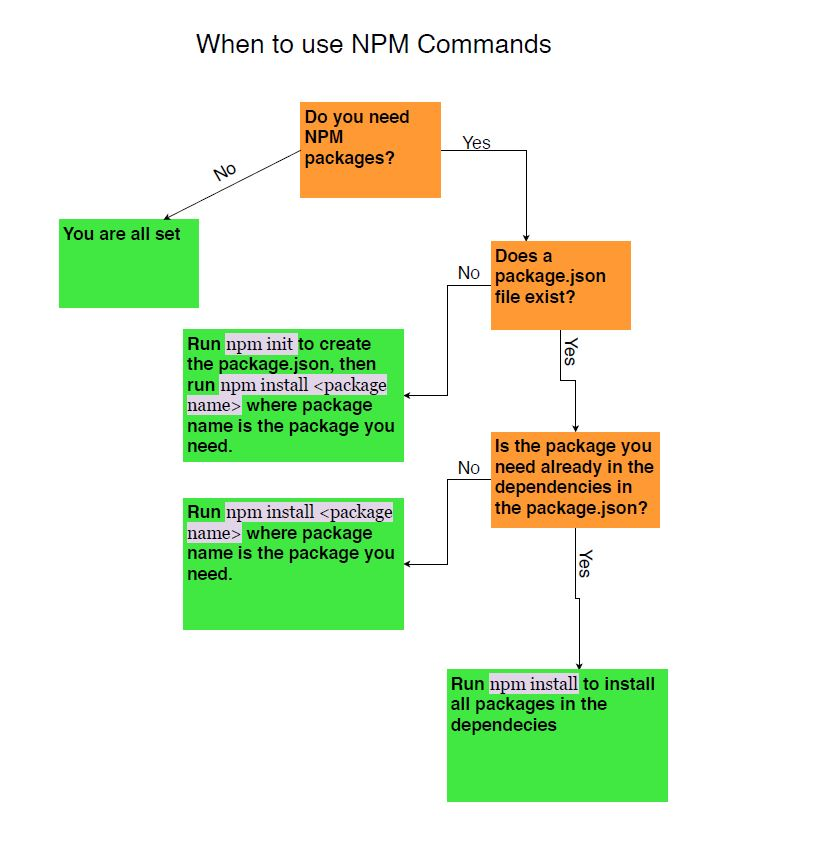

# Workout Tracker

## Description 
The purpose of this application is to ease the user in making plan for their own desired workout with their own exercises by using a reactive website. The user also can add their own workout name, duration of reps and sets, breaks, and description into the specified field and it will automatically generate the workout for you. Also, they can update and delete existing either workout or exercises if they feel like don't need it anymore or bored about it. 
    
## Table of Contents
* [Installation](#installation)
* [Usage](#usage)
* [Credits](#credits)
* [License](#license)

## Installation 
This application requires few installation to made, which are the mongoose, express, and express-handlebars packages. To install both packages, the steps will be explained by screenshot listed as below:
 
  
## Usage 
If there is any confusion in using this application, then users can utitlize the video on this repository. The full video on showing how to use this team proile generator will be shown below:
  

  
## Contributions
 

Language Contributions

To use the badges, feel free to check [shields.io](https://shields.io/) website for variety of badges

## Test Instruction 
Proof of test result of this application works (Shown by Connection ID)

## License 
  
MIT License

## Application Screenshot

